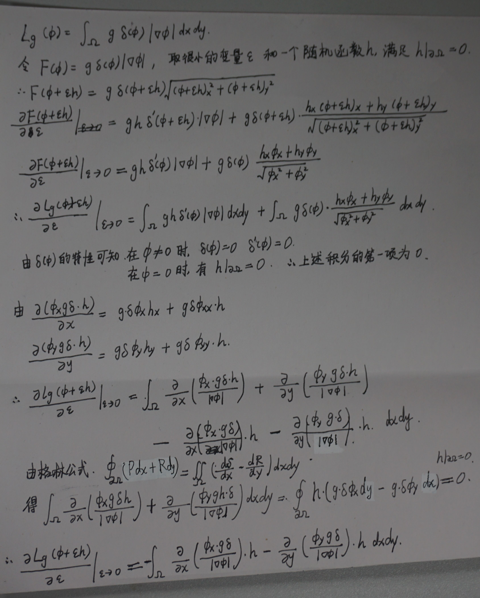
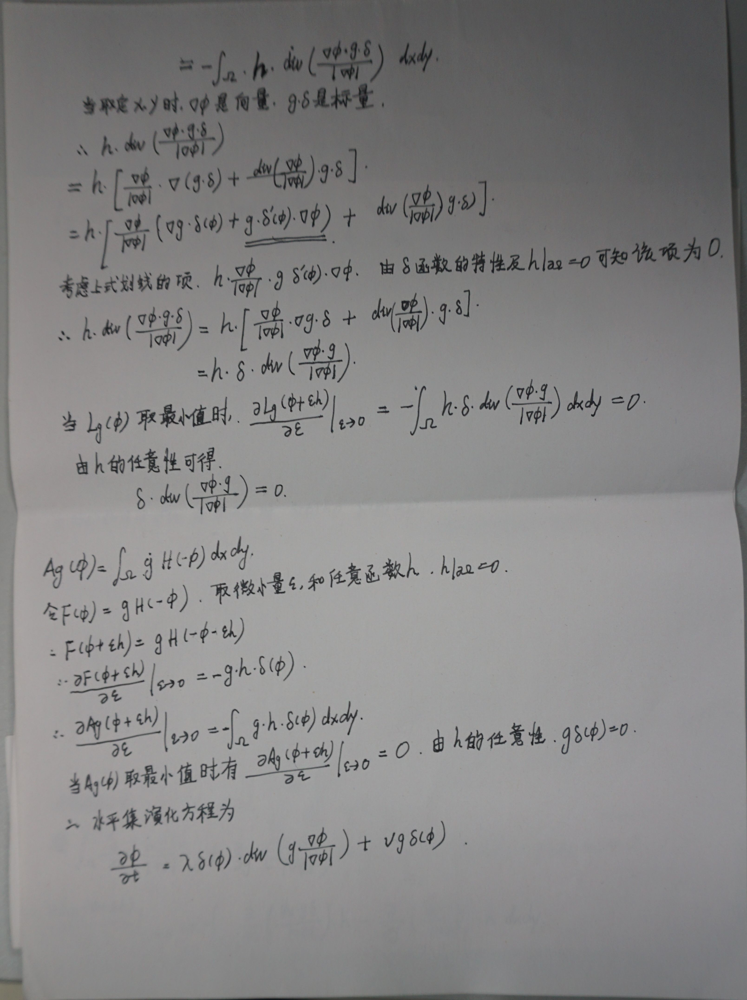

## Level Set Evolution Without Re-initialization Implementation

#### 新的代码包括三项：

1. new_demo.m  算法的参数，level-set function 初始化，外层迭代
2. new_revolution.m  内层循环，依据推导出的算法实现level-set function 的迭代
3. edge_detector.m 实现 $$ g=\frac{1}{1+|{\bigtriangledown G_{\sigma}}*I|^{2}}$$

#### 结果

​	对于three.bmp和twocell.bmp分割效果较好，对vessel.bmp分割效果较差

​	初始值zero level set函数的包含的区域要包含目标（nu为正值）

公式的推导如下：

 

联系方式：zhyx12@gmail.com